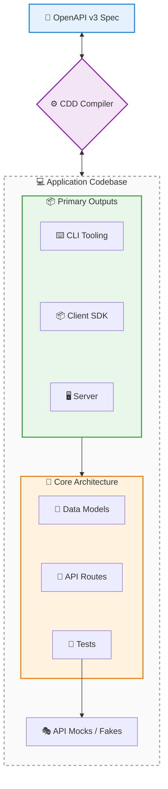

cdd-ruby
============

[](https://opensource.org/licenses/Apache-2.0)
[](https://offscale.io/wasm_web_demo)
[](https://github.com/SamuelMarks/cdd-ruby/actions)
[](#)
[](#)

**Compiler Driven Development (CDD)** is a development approach designed to eradicate the disconnect between: API specifications; server implementations; client SDKs; and command-line tooling.

Unlike traditional code generators—that treat outputs as disposable or read-only—CDD provides a **complete, standalone compiler** for each supported language. These compilers are fully CST-aware (Concreate Syntax Tree is a whitespace+comment aware Abstract Syntax Tree), allowing true bidirectional synchronization between existing hand-edited source code and OpenAPI specifications.

---

## 🏗️ The Standalone Compiler Architecture

Traditional tools use naïve templating—if you regenerate, your custom code is overwritten. 

The CDD ecosystem is fundamentally different. It utilizes language-specific, standalone compilers capable of full AST parsing, semantic diffing, and surgical patching.

**The Core Guarantee:** Every part of the generated codebase is fully editable. 
You are encouraged to open the generated routing files, model definitions, and CLI structures, and directly inject your business logic. 

- **When your specification changes**, the CDD compiler reads your code, builds an AST, diffs it against the new spec, and safely patches in new endpoints or fields without touching your custom logic.
- **When your codebase changes**, the compiler reverse-engineers your structural updates back into a 100% accurate, authoritative OpenAPI specification.

---

## 🔄 The Bidirectional Synchronization Loop



The CDD lifecycle supports continuous evolution from any starting point:
1. **Generate**: Scaffold servers, SDKs, or CLIs from a central specification.
2. **Edit**: Developers write real, unconstrained code directly in the generated files.
3. **Extract**: Reverse-compile the edited code to produce an updated OpenAPI spec.
4. **Sync**: Apply new specification changes seamlessly into the existing, hand-edited codebase.

---

## 🌐 The Global Language Ecosystem

Every supported language operates on the same core CDD philosophies but is powered by a dedicated, native compiler tailored to that language's specific AST, idioms, and package management.

All implementations share a standardized CLI interface (`cdd [subcommand]`), acting as a universal toolchain.

| Repository | Language | Client; Client CLI; Server | Extra features | Standards | CI Status |
|---|---|---|---|---|---|
| [`cdd-c`](https://github.com/SamuelMarks/cdd-c) | C (C89) | Client; Client CLI; Server | FFI | Swagger 2.0 & OpenAPI 3.2.0 | [](https://github.com/SamuelMarks/cdd-c/actions/workflows/ci.yml) |
| [`cdd-cpp`](https://github.com/SamuelMarks/cdd-cpp) | C++ | Client; Client CLI; Server | Upgrades Swagger & Google Discovery to OpenAPI 3.2.0 | Google Discovery; Swagger 2.0 & OpenAPI 3.2.0 | [](https://github.com/SamuelMarks/cdd-cpp/actions/workflows/ci.yml) |
| [`cdd-csharp`](https://github.com/SamuelMarks/cdd-csharp) | C# | Client; Client CLI; Server | CLR | Swagger 2.0 & OpenAPI 3.2.0 | [](https://github.com/SamuelMarks/cdd-csharp/actions/workflows/ci.yml) |
| [`cdd-go`](https://github.com/SamuelMarks/cdd-go) | Go | Client; Client CLI; Server | | Swagger 2.0 & OpenAPI 3.2.0 | [](https://github.com/SamuelMarks/cdd-go/actions/workflows/ci.yml) |
| [`cdd-java`](https://github.com/SamuelMarks/cdd-java) | Java | Client; Client CLI; Server | | Swagger 2.0 & OpenAPI 3.2.0 | [](https://github.com/SamuelMarks/cdd-java/actions/workflows/ci.yml) |
| [`cdd-kotlin`](https://github.com/offscale/cdd-kotlin) | Kotlin (ktor for Multiplatform) | Client; Client CLI; Server | Auto-Admin UI | Swagger 2.0 & OpenAPI 3.2.0 | [](https://github.com/offscale/cdd-kotlin/actions/workflows/ci.yml) |
| [`cdd-php`](https://github.com/SamuelMarks/cdd-php) | PHP | Client; Client CLI; Server | | Swagger 2.0 & OpenAPI 3.2.0 | [](https://github.com/SamuelMarks/cdd-php/actions/workflows/ci.yml) |
| [`cdd-python`](https://github.com/offscale/cdd-python) | Python | N/A (server building blocks) | CLI ↔ SQL ↔ Pydantic ↔ docs ↔ JSON-schema | N/A | [](https://github.com/offscale/cdd-python/actions) |
| [`cdd-python-all`](https://github.com/offscale/cdd-python-all) | Python | Client; Client CLI; Server |  | Swagger 2.0 & OpenAPI 3.2.0 | [](https://github.com/offscale/cdd-python-all/actions/workflows/ci.yml) |
| [`cdd-ruby`](https://github.com/SamuelMarks/cdd-ruby) | Ruby | Client; Client CLI; Server |  | Swagger 2.0 & OpenAPI 3.2.0 | [](https://github.com/SamuelMarks/cdd-ruby/actions/workflows/ci.yml) |
| [`cdd-rust`](https://github.com/SamuelMarks/cdd-rust) | Rust | Client; Client CLI; Server |  | Swagger 2.0 & OpenAPI 3.2.0 | [](https://github.com/offscale/cdd-rust/actions/workflows/ci.yml) |
| [`cdd-sh`](https://github.com/SamuelMarks/cdd-sh) | Shell (/bin/sh) | Client; Client CLI; Server |  | Swagger 2.0 & OpenAPI 3.2.0 | [](https://github.com/SamuelMarks/cdd-sh/actions/workflows/ci.yml) |
| [`cdd-swift`](https://github.com/SamuelMarks/cdd-swift) | Swift | Client; Client CLI; Server |  | Swagger 2.0 & OpenAPI 3.2.0 | [](https://github.com/SamuelMarks/cdd-swift/actions/workflows/ci.yml) |
| [`cdd-ts`](https://github.com/offscale/cdd-ts) | TypeScript | Client; Client CLI; Server | Auto-Admin UI; Angular; React; Vue; fetch; Axios; Node.js | Swagger 2.0 & OpenAPI 3.2.0 | [](https://github.com/offscale/cdd-ts/actions/workflows/ci.yml) |

---

## 🛠️ Universal CLI Toolchain

A true ecosystem requires standardized tooling. Once a developer learns the CDD toolchain, they can synchronize architecture across the entire polyglot stack.

### Global Arguments

- `--help`: Print help information.
- `--version`: Print version information.
- `--input, -i` (or `-f`): Target file, directory, or OpenAPI spec.
- `--output, -o`: Destination path for generation or sync.

### Core Subcommands

#### `from_openapi to_sdk_cli`
Generate a client SDK and a corresponding command-line interface (CLI) from an OpenAPI specification.
- `--input, -i <spec>`: Path to the OpenAPI specification file.

#### `from_openapi to_sdk`
Generate a client SDK from an OpenAPI specification.
- `--input, -i <spec>`: Path to the OpenAPI specification file.

#### `from_openapi to_server`
Generate server boilerplate, models, and routing logic from an OpenAPI specification.
- `--input, -i <spec>`: Path to the OpenAPI specification file.

#### `to_openapi`
Parse the existing codebase and extract an authoritative OpenAPI specification.
- `--input, -i <path>` (or `-f <path>`): Path to the source code directory or file to parse.

#### `to_docs_json`
Convert an OpenAPI specification into a localized, documentation-optimized JSON format.
- `--input, -i <spec>`: Path to the OpenAPI specification file.
- `--no-imports`: Disable import statements in the generated documentation.
- `--no-wrapping`: Disable line wrapping in the generated documentation.

#### `serve_json_rpc`
Launch a JSON-RPC server for editor and tool integrations.
- `--port <port>` (or `-p`): Port to listen on (e.g., `8080`).
- `--listen <address>` (or `-l`): Address to bind to (e.g., `0.0.0.0`).

#### `mcp`
Run the Model Context Protocol server via stdio.

#### `sync`
Synchronize an OpenAPI specification with source code.
- `--input, -i <filepath>`: Path to the input file.
- `--truth <class|activerecord|function>`: The source of truth for the synchronization.

### Detail Features Beyond Common Subset

The `cdd-ruby` CLI provides the following features beyond the common subset. Running `cdd-ruby --help` outputs:

```text
cdd-ruby CLI
Usage:
  cdd-ruby [subcommand] [options]

Subcommands:
  from_openapi    Generate code from an OpenAPI specification.
  to_openapi      Generate an OpenAPI specification from source code.
  to_docs_json    Generate JSON documentation with code snippets for an OpenAPI specification.
  serve_json_rpc  Expose CLI interface as a JSON-RPC server.
  mcp             Start the Model Context Protocol (MCP) server for generator orchestration.

Options:
  --help, -h      Show this help message
  --version, -v   Show version information

Examples:
  cdd-ruby serve_json_rpc [--wasi]
  cdd-ruby from_openapi to_sdk_cli -i <spec.json> [-o <target_directory>] [--no-github-actions] [--no-installable-package] [--tests] [--mcp]
  cdd-ruby from_openapi to_sdk -i <spec.json> [-o <target_directory>] [--no-github-actions] [--no-installable-package] [--tests] [--mcp]
  cdd-ruby from_openapi to_server -i <spec.json> [-o <target_directory>]
  cdd-ruby to_openapi -i <path/to/code> [-o <spec.json>]
  cdd-ruby to_docs_json [--no-imports] [--no-wrapping] -i <spec.json> [-o <docs.json>]
```

Additionally, the following specific features are supported:
- **`--tests` flag support**: Can generate RSpec test scaffolding when `--tests` is provided to `from_openapi`.
- **`--mcp` flag support**: Can include Model Context Protocol support when `--mcp` is provided to `from_openapi`.
- **`--no-github-actions` and `--no-installable-package`**: Fine-grained control over generated SDK scaffolding.
- **`--with-ephemeral` and `--with-seed`**: Additional control over `from_openapi` code generation behavior.
- **Directory Input for `to_openapi`**: Allows scanning a directory structure of Ruby files to combine into a single OpenAPI specification.

---

## 🚀 The End of "Spec Drift"

With Compiler Driven Development, specifications and code are no longer loosely coupled artifacts. They are strict, isomorphic reflections of one another, maintained by dedicated standalone compilers. 

Choose your language ecosystem above and start treating your architecture as a seamlessly compiled, endlessly editable whole.

---

## License

Licensed under either of

- Apache License, Version 2.0 ([LICENSE-APACHE](LICENSE-APACHE) or <https://www.apache.org/licenses/LICENSE-2.0>)
- MIT license ([LICENSE-MIT](LICENSE-MIT) or <https://opensource.org/licenses/MIT>)

at your option.

### Contribution

Unless you explicitly state otherwise, any contribution intentionally submitted
for inclusion in the work by you, as defined in the Apache-2.0 license, shall be
dual licensed as above, without any additional terms or conditions.
